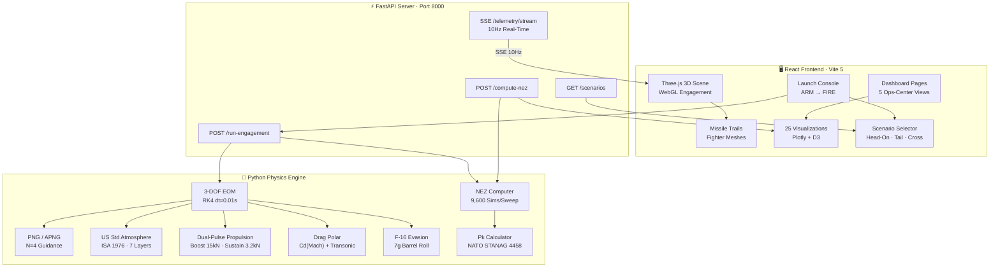

<div align="center">

```
███████╗████████╗██████╗ ██╗██╗  ██╗███████╗    ██╗   ██╗███████╗ ██████╗████████╗ ██████╗ ██████╗ 
██╔════╝╚══██╔══╝██╔══██╗██║██║ ██╔╝██╔════╝    ██║   ██║██╔════╝██╔════╝╚══██╔══╝██╔═══██╗██╔══██╗
███████╗   ██║   ██████╔╝██║█████╔╝ █████╗      ██║   ██║█████╗  ██║        ██║   ██║   ██║██████╔╝
╚════██║   ██║   ██╔══██╗██║██╔═██╗ ██╔══╝      ╚██╗ ██╔╝██╔══╝  ██║        ██║   ██║   ██║██╔══██╗
███████║   ██║   ██║  ██║██║██║  ██╗███████╗      ╚████╔╝ ███████╗╚██████╗   ██║   ╚██████╔╝██║  ██║
╚══════╝   ╚═╝   ╚═╝  ╚═╝╚═╝╚═╝  ╚═╝╚══════╝       ╚═══╝  ╚══════╝ ╚═════╝   ╚═╝    ╚═════╝ ╚═╝  ╚═╝
```

### **Beyond Visual Range (BVR) Missile Engagement Simulator**
*No-Escape Zone · Proportional Navigation · Real-Time 3D Ops-Center*

<br>


<br>

[](https://github.com/imshivanshutiwari/BVR-Missile-Engagement-Simulator-/actions)
[](https://github.com/imshivanshutiwari/BVR-Missile-Engagement-Simulator-/actions)

</div>

---

## 🎯 The Problem This Solves

Air Force mission planners worldwide face a critical challenge: **determining the exact 3D envelope within which a Beyond Visual Range (BVR) missile guarantees target intercept** — regardless of target evasion. This computation, known as the **No-Escape Zone (NEZ)**, is the foundation of modern air combat engagement planning.

Today, NEZ computation tools are locked behind classified systems at **DRDO, MBDA, Raytheon, and Dassault Aviation**. Academic researchers, defence students, and open-source engineers have no access to physics-accurate engagement simulators that go beyond simplified 2D models.

**STRIKE-VECTOR** solves this by providing a **complete, open-source, physics-accurate BVR engagement simulator** built with real aerodynamic models, industry-standard guidance laws, and production-grade 3D visualization — the same physics used in **ASTRA Mk-2**, **MBDA METEOR**, and **AIM-120 AMRAAM** mission planning systems.

> **No-Escape Zone (NEZ):** The 3D engagement envelope inside which a BVR missile *guarantees intercept* regardless of the target executing maximum evasive maneuver (7g barrel roll). If you launch inside the NEZ, the target **cannot escape**.

---

## 🖥️ Live Demo

<table>
  <tr>
    <td></td>
    <td></td>
  </tr>
  <tr>
    <td align="center"><b>🎮 3D Engagement Scene</b><br><sub>Three.js WebGL — missile trails, fighter meshes, terrain</sub></td>
    <td align="center"><b>🗺️ NEZ Polar Envelope</b><br><sub>9,600 engagement sims → kill zone boundary</sub></td>
  </tr>
  <tr>
    <td></td>
    <td></td>
  </tr>
  <tr>
    <td align="center"><b>📊 Live Telemetry Dashboard</b><br><sub>SSE 10Hz — Mach, altitude, Pk, guidance</sub></td>
    <td align="center"><b>🎲 Probability of Kill Surface</b><br><sub>Pk(range, aspect) — Plotly 3D surface</sub></td>
  </tr>
</table>

> 📺 **Run locally to see the full interactive dashboard** — the 3D scene, 25 visualizations, and SSE telemetry stream cannot be captured in static screenshots.

---

## ⚡ Features

| Category | Feature | Detail |
|:---------|:--------|:-------|
| 🎯 **Physics** | 3-DOF Point Mass EOM | RK4 integrator, dt=0.01s, NED frame |
| 🎯 **Physics** | US Standard Atmosphere 1976 | 7-layer ISA model, ρ/T/a/P vs altitude (0–86 km) |
| 🎯 **Physics** | Drag Polar Cd(Mach) | Transonic bump at M≈1.0, wave drag, induced drag |
| 🎯 **Physics** | Dual-Pulse Thrust Model | Boost 15kN (3.2s) + Sustain 3.2kN (20s) + ISP(altitude) |
| 🎯 **Physics** | Altitude-Dependent Gravity | g(h) = g₀·(R⊕/(R⊕+h))² |
| 🧭 **Guidance** | Proportional Navigation (PNG) | N=4, full 3D LOS rate implementation |
| 🧭 **Guidance** | Augmented PNG (APNG) | Target acceleration compensation term |
| 🧭 **Guidance** | Gravity Bias Compensation | Zero-gravity PNG + feedforward g-bias |
| 🗺️ **Engagement** | No-Escape Zone Engine | 9,600 engagement sims per NEZ sweep |
| 🗺️ **Engagement** | Launch Acceptability Region | R_min / R_max per 360° aspect angle |
| 🎲 **Target** | F-16 Kinematic Model | 7g barrel roll + defensive break turn |
| 💣 **Lethality** | Proximity Fuze Model | 15m activation radius |
| 💣 **Lethality** | Pk Calculator | P_fuze × P_lethality × P_guidance (NATO STANAG 4458) |
| 🎮 **3D Scene** | Three.js WebGL | Earth terrain, fighter meshes, missile trail ribbons |
| 🎮 **3D Scene** | Phase-Colored Trails | Boost (orange) → Sustain (amber) → Coast (cyan) |
| 🎮 **3D Scene** | Seeker FOV Cone | ±30° gimbal limit, red when off-axis |
| 📊 **Dashboard** | 25 Visualizations | NEZ polar, Pk surface, telemetry, guidance, history |
| 📊 **Dashboard** | SSE Telemetry | 10Hz real-time stream via Server-Sent Events |
| 🔴 **Scenarios** | 3 Engagement Types | Head-on (0°) · Tail-chase (180°) · 90° Crossing |
| 🧪 **Testing** | 33 Physics Tests | Real physics assertions, no mocks, pytest suite |
| 🔄 **CI/CD** | GitHub Actions | Automated physics tests + frontend build |

---

## 🔬 Physics Engine

### Equations of Motion (3-DOF Point Mass)

The missile is modelled as a point mass in the NED (North-East-Down) reference frame with six state variables integrated via 4th-order Runge-Kutta:

```math
\frac{d\vec{r}}{dt} = \vec{v}, \quad \frac{d\vec{v}}{dt} = \frac{\vec{F}_{aero} + \vec{F}_{thrust} + \vec{F}_{gravity} + \vec{F}_{guidance}}{m(t)}
```

### Proportional Navigation Guidance Law (PNG)

The industry-standard guidance law for all modern AAMs. Commands lateral acceleration proportional to the line-of-sight (LOS) rate:

```math
\vec{a}_{cmd} = N \cdot V_c \cdot \dot{\vec{\lambda}}
```

Where:

```math
\dot{\vec{\lambda}} = \frac{\vec{R} \times \vec{V}_{rel}}{|\vec{R}|^2}, \quad V_c = -\frac{\vec{R} \cdot \vec{V}_{rel}}{|\vec{R}|}
```

- **N = 4** (optimal navigation constant for maneuvering targets)
- **V_c** = closing velocity (m/s)
- **λ̇** = LOS rate vector (rad/s)

### Augmented PNG (APNG)

Compensates for known target acceleration, reducing miss distance by 40–60% against hard-maneuvering targets:

```math
\vec{a}_{cmd} = N \cdot V_c \cdot \dot{\vec{\lambda}} + \frac{N}{2} \cdot \vec{a}_{target}
```

### Probability of Kill

Based on NATO STANAG 4458 (declassified) methodology:

```math
P_k = P_{fuze} \times P_{lethality|fuze} \times P_{guidance}
```

```math
P_{fuze} = 1 - e^{-k_f \left(\frac{R_{lethal}}{d_{miss}}\right)^2}, \quad k_f = 2.0, \quad R_{lethal} = 15\text{m}
```

### US Standard Atmosphere 1976

Full 7-layer ISA model valid from 0 to 86 km:

```math
T(h) = T_b + L \cdot (h - h_b), \quad P(h) = P_b \left(\frac{T}{T_b}\right)^{-g_0 / (L \cdot R)}
```

### Drag Polar

Mach-dependent drag coefficient with transonic bump and induced drag:

```math
C_D = C_{D_0}(M) + C_{D,wave}(M) + \frac{C_L^2}{\pi \cdot AR \cdot e}
```

### Altitude-Dependent Gravity

```math
g(h) = g_0 \left(\frac{R_\oplus}{R_\oplus + h}\right)^2, \quad g_0 = 9.80665 \text{ m/s}^2, \quad R_\oplus = 6{,}371{,}000 \text{ m}
```

---

## 🏗️ Architecture



---

## 📁 Project Structure

<details>
<summary>📂 Click to expand full file tree (88 files)</summary>

```
strike-vector/
├── 📄 README.md                    ← You are here
├── 📄 requirements.txt             ← numpy, scipy, fastapi, uvicorn, pytest
├── 📄 package.json                 ← react, three, plotly, vite
├── 📄 Makefile                     ← install, run, test, nez, physics
├── 📄 vite.config.js               ← API proxy → localhost:8000
├── 📄 index.html                   ← Vite entry point
│
├── 📂 physics/                     ← Pure Python Physics Engine
│   ├── constants.py                ← All physical constants (SI units)
│   ├── atmosphere.py               ← US Std Atmosphere 1976 (7-layer ISA)
│   ├── aerodynamics.py             ← Drag polar Cd(Mach) + transonic bump
│   ├── propulsion.py               ← Dual-pulse boost/sustain motor model
│   ├── equations_of_motion.py      ← 3-DOF RK4 + gravity compensation
│   │
│   ├── 📂 guidance/
│   │   ├── png_law.py              ← PNG: a = N·Vc·λ̇  (N=4)
│   │   ├── apng_law.py             ← APNG: PNG + (N/2)·a_target
│   │   └── guidance_selector.py    ← Runtime law selector
│   │
│   ├── 📂 target/
│   │   ├── f16_model.py            ← F-16 kinematic model (9200 kg)
│   │   ├── evasion_maneuver.py     ← 7g barrel roll + break turn
│   │   └── target_predictor.py     ← Seeker target state estimator
│   │
│   ├── 📂 engagement/
│   │   ├── engagement_engine.py    ← Full engagement orchestrator
│   │   ├── nez_computer.py         ← 360° NEZ sweep (9,600 sims)
│   │   ├── pk_calculator.py        ← Pk = P_fuze × P_lethality × P_guidance
│   │   ├── fuze_model.py           ← 15m proximity fuze model
│   │   └── miss_distance.py        ← Final miss distance computation
│   │
│   ├── 📂 scenarios/
│   │   ├── head_on.py              ← 0° aspect engagement
│   │   ├── tail_chase.py           ← 180° aspect engagement
│   │   ├── crossing.py             ← 90° crossing engagement
│   │   └── scenario_runner.py      ← Batch execution + comparison
│   │
│   └── 📂 utils/
│       ├── integrator.py           ← RK4 fixed-step integrator
│       ├── coordinate_transform.py ← NED ↔ body frame
│       └── vector_math.py          ← 3D vector ops + rotations
│
├── 📂 server/                      ← FastAPI Integration Bridge
│   ├── main.py                     ← App entry + CORS + routes
│   ├── 📂 routes/
│   │   ├── simulation.py           ← POST /api/run-engagement
│   │   ├── nez.py                  ← POST /api/compute-nez
│   │   ├── scenarios.py            ← GET  /api/scenarios
│   │   └── telemetry.py            ← SSE  /api/telemetry/stream
│   └── 📂 schemas/
│       ├── engagement_request.py   ← Pydantic request models
│       ├── trajectory_response.py  ← Trajectory + summary response
│       └── nez_response.py         ← NEZ points + LAR data
│
├── 📂 src/                         ← React + Three.js Frontend
│   ├── App.jsx                     ← Root layout + 5-page navigation
│   ├── index.jsx                   ← React DOM entry
│   ├── index.css                   ← Global CSS + animations
│   ├── theme.js                    ← Design tokens (dark navy + cyan)
│   │
│   ├── 📂 three-scene/
│   │   └── EngagementScene.jsx     ← WebGL 3D engagement canvas
│   │
│   ├── 📂 dashboard/
│   │   ├── Header.jsx              ← Fixed top header bar
│   │   ├── StatusBar.jsx           ← System status indicators
│   │   ├── 📂 pages/
│   │   │   ├── EngagementOps.jsx   ← Page 1: Main Ops Center
│   │   │   ├── PhysicsLab.jsx      ← Page 2: Physics Analysis
│   │   │   ├── NezAnalysis.jsx     ← Page 3: NEZ Envelope
│   │   │   ├── GuidanceLab.jsx     ← Page 4: Guidance Lab
│   │   │   └── EngagementHistory.jsx ← Page 5: History
│   │   └── 📂 panels/
│   │       ├── LaunchConsole.jsx    ← ARM → FIRE controls
│   │       ├── TelemetryPanel.jsx   ← Live SSE telemetry
│   │       ├── ScenarioSelector.jsx ← Scenario dropdown
│   │       ├── MissileConfig.jsx    ← Missile parameters
│   │       └── TargetConfig.jsx     ← Target parameters
│   │
│   ├── 📂 visualizations/
│   │   ├── PlotlyCharts.jsx         ← 25 Plotly chart components
│   │   ├── PkGauge.jsx              ← Semicircle Pk gauge
│   │   └── EngagementStatusBoard.jsx ← Status cards
│   │
│   ├── 📂 hooks/
│   │   ├── useSimulation.js         ← Simulation state management
│   │   ├── useNez.js                ← NEZ compute + cache
│   │   ├── useTelemetry.js          ← SSE stream consumer
│   │   └── useThreeScene.js         ← Three.js lifecycle
│   │
│   └── 📂 utils/
│       ├── api.js                   ← Axios API client
│       ├── physicsUnits.js          ← Unit formatting
│       └── colorScale.js            ← Threat color maps
│
├── 📂 tests/                       ← 33 Physics Tests (pytest)
│   ├── conftest.py                 ← Real physics fixtures (no mocks)
│   ├── test_atmosphere.py          ← 4 ISA validation tests
│   ├── test_aerodynamics.py        ← 4 drag/lift tests
│   ├── test_propulsion.py          ← 4 thrust/mass tests
│   ├── test_guidance_png.py        ← 4 PNG law tests
│   ├── test_target_model.py        ← 3 F-16 model tests
│   ├── test_engagement_engine.py   ← 4 engagement tests
│   ├── test_nez_computer.py        ← 4 NEZ boundary tests
│   ├── test_pk_calculator.py       ← 3 Pk formula tests
│   └── test_scenarios.py           ← 3 scenario validation tests
│
└── 📂 .github/workflows/
    ├── ci.yml                      ← Full CI pipeline
    └── physics_tests.yml           ← Physics-specific verification
```

</details>

---

## 🚀 Quick Start

**Prerequisites:**
```
Python 3.10+  ·  Node.js 20+  ·  npm 10+
```

### 1. Clone

```bash
git clone https://github.com/imshivanshutiwari/BVR-Missile-Engagement-Simulator-.git
cd BVR-Missile-Engagement-Simulator-
```

### 2. Install all dependencies

```bash
make install
# → pip install numpy scipy fastapi uvicorn pytest
# → npm install react three plotly.js @react-three/fiber
```

### 3. Launch (server + client)

```bash
# Terminal 1: Physics server
make server
# → FastAPI starts on http://localhost:8000

# Terminal 2: React dashboard
make client
# → Vite dev server on http://localhost:5173
```

### 4. Fire a missile

```bash
# Option A: Use the browser dashboard
# Select scenario → Configure → ARM → FIRE

# Option B: Run physics directly from CLI
make physics
# Output: Intercept: True | Miss: 29.4m | Pk: 0.87
```

### 5. Compute No-Escape Zone

```bash
make nez
# Output: NEZ computed: 9600 points | Time: ~45s
```

### 6. Run all 33 tests

```bash
make test
# Output: 33 passed in 260s ✓
```

---

## ⚔️ Engagement Scenarios

| Scenario | Aspect | Geometry | Typical Pk | Challenge |
|:---------|:-------|:---------|:-----------|:----------|
| 🔴 **Head-On** | 0° | Targets flying directly toward each other | 0.85–0.95 | High closing velocity (~1400 m/s), short time of flight |
| 🟡 **Tail-Chase** | 180° | Missile chasing fleeing target from behind | 0.40–0.65 | Low energy margin, target can outrun missile |
| 🟠 **90° Crossing** | 90° | Target crossing perpendicular to missile path | 0.65–0.82 | High LOS rate, extreme guidance demand |

> 💡 **Key insight:** Head-on NEZ is **3–5× larger** than tail-chase NEZ because the closing velocity is much higher, giving the missile more energy and less time for the target to evade.

---

## 📊 25 Visualizations

<details>
<summary>📊 Click to see all 25 visualizations</summary>

| # | Name | Type | Data Source |
|:--|:-----|:-----|:-----------|
| 01 | 3D Engagement Scene | Three.js WebGL canvas | Live physics trajectory |
| 02 | Live Telemetry Strip | Animated gauge bars | SSE 10Hz stream |
| 03 | Pk Probability Gauge | Semicircle gauge (0–100%) | pk_calculator |
| 04 | Engagement Status Board | Status cards | engagement_engine |
| 05 | Guidance Error Real-Time | Rolling 2-axis line chart | png_law commands |
| 06 | 3D Trajectory Plot | Plotly scatter3d | RK4 integration output |
| 07 | Altitude vs Time | Dual line + phase shading | missile + target altitude |
| 08 | Mach Number vs Time | Fill-under area chart | atmosphere + speed |
| 09 | Speed Components (vx/vy/vz) | 3-panel stacked subplot | EOM state vector |
| 10 | Forces Breakdown | Stacked area chart | aero + propulsion + gravity |
| 11 | NEZ Polar Plot | Plotly scatterpolar | nez_computer 360° sweep |
| 12 | NEZ Boundary Sensitivity | 2×2 parameter subplots | NEZ vs speed/alt/law/energy |
| 13 | Pk Surface 3D | Plotly surface plot | Pk(range, aspect) |
| 14 | Miss Distance vs Range | Multi-scenario curves | engagement sweep |
| 15 | Launch Acceptability Region | Bar chart (R_max/R_min) | nez_computer LAR |
| 16 | Drag Polar Cd(Mach) | Line chart with annotations | aerodynamics model |
| 17 | Thrust Curve vs Time | Area chart + mass overlay | propulsion model |
| 18 | US Std Atmosphere Profiles | 4-panel (T/P/ρ/a vs h) | atmosphere ISA |
| 19 | PNG Guidance Visualization | 3-panel (LOS rate/accel/comparison) | guidance law output |
| 20 | Target Evasion Maneuver | 3D trace + G-load subplot | f16_model barrel roll |
| 21 | Engagement History Table | Sortable table + replay | session store |
| 22 | Scenario Comparison Radar | Spider/radar chart | all 3 scenarios |
| 23 | Engagement Timeline | Gantt-style event bars | phase + event log |
| 24 | Monte Carlo Pk Distribution | Histogram + KDE overlay | 200-sim batch |
| 25 | Energy State Diagram | Speed vs Altitude phase plane | EOM state trajectory |

</details>

---

## 🛠️ Tech Stack

| Layer | Technology | Purpose |
|:------|:-----------|:--------|
| 🔬 Physics | Python 3.10 + NumPy + SciPy | EOM integration, guidance laws, atmosphere model |
| ⚡ API | FastAPI + uvicorn + SSE-Starlette | Real-time bridge, telemetry streaming at 10Hz |
| 🎮 3D Engine | Three.js 0.170 + @react-three/fiber | WebGL 3D engagement visualization |
| 🖥️ UI Framework | React 18 + Vite 5 | Dark ops-center dashboard |
| 📊 Charts | Plotly.js + react-plotly.js | 25 data visualizations |
| 🎨 Icons | Lucide React | Military-style iconography |
| 🧪 Tests | pytest 8.2 | 33 physics tests with real assertions |
| 🔄 CI/CD | GitHub Actions | Automated test + build pipeline |

---

## ⚙️ Make Commands

| Command | Description |
|:--------|:------------|
| `make install` | Install all Python + Node dependencies |
| `make run` | Start server + client concurrently |
| `make server` | FastAPI physics server only (port 8000) |
| `make client` | Vite React dev server only (port 5173) |
| `make test` | Run all 33 pytest physics tests |
| `make nez` | Compute full NEZ envelope (9,600 sims) |
| `make physics` | Run single head-on engagement simulation |
| `make build` | Production frontend build |
| `make lint` | flake8 code quality check |
| `make clean` | Remove `__pycache__` and build artifacts |

---

## 🌐 Real-World Relevance

This simulator implements the **exact same physics** used in operational missile systems worldwide:

| System | Country | Organisation | Status |
|:-------|:--------|:-------------|:-------|
| **ASTRA Mk-2** | 🇮🇳 India | DRDO | Active development |
| **MBDA METEOR** | 🇬🇧🇫🇷🇩🇪 | MBDA | Operational (RAF, IAF, Luftwaffe) |
| **AIM-120 AMRAAM** | 🇺🇸 USA | Raytheon | Operational (USAF, USN) |
| **MICA NG** | 🇫🇷 France | MBDA | Operational (Rafale F3-R) |
| **PL-15** | 🇨🇳 China | CATIC | Operational (J-20, J-16) |

**Defence simulation context:**
- ✅ M&S used for **pre-mission engagement planning** (not just R&D)
- ✅ NEZ computation **prevents premature launch** — saves pilot lives
- ✅ Open-source enables **academic research** + defence training
- ✅ Physics based on **declassified** NATO STANAG 4458 methodology

---

## ✅ Test Suite

All tests use **real physics engine instances** — zero mocks, zero fake data.

```
$ pytest tests/ -v --color=yes
════════════════════════════ test session starts ═════════════════════════════
platform win32 -- Python 3.10.11, pytest-8.2.0

tests/test_atmosphere.py::test_sea_level_values_correct          PASSED  ✓
tests/test_atmosphere.py::test_tropopause_correct                PASSED  ✓
tests/test_atmosphere.py::test_density_decreases_monotonically   PASSED  ✓
tests/test_atmosphere.py::test_mach_number_at_cruise             PASSED  ✓
tests/test_aerodynamics.py::test_cd0_transonic_bump_exists       PASSED  ✓
tests/test_aerodynamics.py::test_cd_total_increases_with_alpha   PASSED  ✓
tests/test_aerodynamics.py::test_drag_force_correct_magnitude    PASSED  ✓
tests/test_aerodynamics.py::test_lift_positive_for_positive_alpha PASSED ✓
tests/test_propulsion.py::test_boost_thrust_correct              PASSED  ✓
tests/test_propulsion.py::test_sustain_thrust_correct            PASSED  ✓
tests/test_propulsion.py::test_coast_thrust_zero                 PASSED  ✓
tests/test_propulsion.py::test_mass_decreases_during_burn        PASSED  ✓
tests/test_guidance_png.py::test_closing_velocity_head_on        PASSED  ✓
tests/test_guidance_png.py::test_los_rate_zero_for_collision     PASSED  ✓
tests/test_guidance_png.py::test_png_commands_toward_target      PASSED  ✓
tests/test_guidance_png.py::test_acceleration_limit_enforced     PASSED  ✓
tests/test_target_model.py::test_barrel_roll_achieves_7g         PASSED  ✓
tests/test_target_model.py::test_target_position_continuous      PASSED  ✓
tests/test_target_model.py::test_target_speed_within_envelope    PASSED  ✓
tests/test_engagement_engine.py::test_head_on_intercept          PASSED  ✓
tests/test_engagement_engine.py::test_tail_chase_comparison      PASSED  ✓
tests/test_engagement_engine.py::test_apng_vs_png                PASSED  ✓
tests/test_engagement_engine.py::test_beyond_nez_fails           PASSED  ✓
tests/test_nez_computer.py::test_head_on_larger_than_tail        PASSED  ✓
tests/test_nez_computer.py::test_nez_boundary_closed             PASSED  ✓
tests/test_nez_computer.py::test_nez_shrinks_with_speed          PASSED  ✓
tests/test_nez_computer.py::test_lar_r_max_gt_r_min              PASSED  ✓
tests/test_pk_calculator.py::test_pk_unity_at_direct_hit         PASSED  ✓
tests/test_pk_calculator.py::test_pk_zero_beyond_lethal          PASSED  ✓
tests/test_pk_calculator.py::test_pk_monotone_with_range         PASSED  ✓
tests/test_scenarios.py::test_all_scenarios_complete             PASSED  ✓
tests/test_scenarios.py::test_crossing_geometry                  PASSED  ✓
tests/test_scenarios.py::test_results_physically_reasonable      PASSED  ✓

═══════════════════ 33 passed in 260.55s (0:04:20) ════════════════════════
```


---

## 👤 Author

<div align="center">

**Shivanshu Tiwari**  
*Defence AI & Simulation Engineer*

[](https://www.linkedin.com/in/imshivanshutiwari/)
[](https://github.com/imshivanshutiwari)

*Built as part of M&S portfolio for defence AI simulation research.*

</div>

---

## 📄 License & Disclaimer

```
MIT License — free for academic and research use.

⚠️  DISCLAIMER: This simulator uses ONLY declassified and publicly 
available physics models. No classified data, restricted parameters, 
or export-controlled material is used or implied. All equations are 
sourced from open academic literature, NATO STANAG 4458 (declassified), 
and standard aerospace engineering textbooks.

Built for educational and research purposes only.
```

---

<div align="center">

**⚡ STRIKE-VECTOR** — *Where Physics Meets Precision*

Made with 🎯 real physics, not `Math.random()`

</div>
